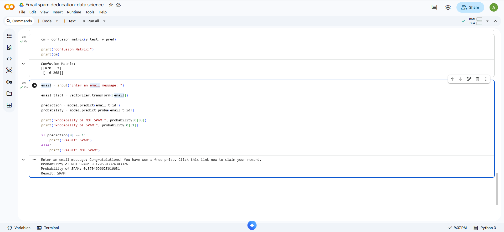

# Email Spam Detection Using Machine Learning

## 📌 Project Overview

This project uses Machine Learning to classify email messages as **Spam** or **Not Spam**.

The project uses **TF-IDF (Term Frequency-Inverse Document Frequency)** to convert email text into numerical features and **Multinomial Naive Bayes** to classify the messages.

## 🎯 Objective

The main objective is to build a simple machine learning model that can automatically identify whether an email message is spam or not spam.

## 🛠️ Technologies Used

- Python
- Pandas
- Scikit-learn
- TF-IDF Vectorization
- Multinomial Naive Bayes
- Matplotlib
- Seaborn
- Google Colab

## 🔄 Project Workflow

Dataset  
↓  
Data Preprocessing  
↓  
Train-Test Split  
↓  
TF-IDF Vectorization  
↓  
Multinomial Naive Bayes  
↓  
Prediction  
↓  
Spam / Not Spam

## 🤖 Machine Learning Algorithm

### Multinomial Naive Bayes

Multinomial Naive Bayes is a classification algorithm commonly used for text classification.

In this project, it is used to classify email messages into:

- Spam
- Not Spam

## 📝 Text Feature Extraction

### TF-IDF

TF-IDF converts text into numerical values that can be used by a machine learning model.

It gives higher importance to words that are useful for distinguishing between different email categories.

## 📊 Model Evaluation

The model is evaluated using:

- Accuracy
- Precision
- Recall
- F1-score
- Confusion Matrix
- Classification Report

## 💻 Dataset

The project uses an email dataset containing messages labelled as spam or not spam.

## 🚀 How to Run

1. Open the Jupyter Notebook (`.ipynb`) in Google Colab or Jupyter Notebook.
2. Upload the dataset.
3. Run the cells in order.
4. Enter an email message when prompted.
5. The model predicts whether the email is **SPAM** or **NOT SPAM**.

## 📌 Project Outcome

The project demonstrates how Natural Language Processing and Machine Learning can be combined to perform automatic email spam classification.

## 📸 Project Output

The model can take a new email message and predict whether it is Spam or Not Spam.

## 👩‍💻 Author

**Ashwathi K**
